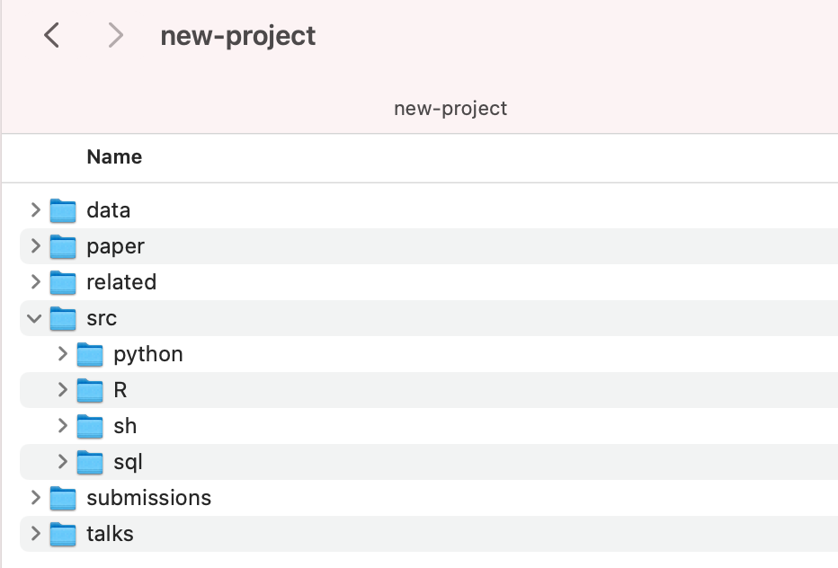
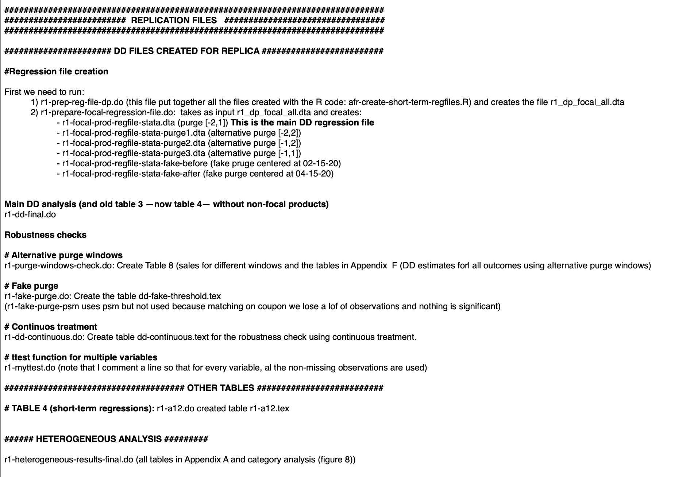

```{r setup, include=FALSE}
library(tidyverse)
library(hrbrthemes)
library(fontawesome)
library(data.table)
library(ggthemes)
library(scales)
```

# Introduction

### About me

`r fa('graduation-cap')` Associate Professor of Marketing

`r fa('address-book')` [Davide Proserpio](https://dadepro.github.io/)

`r fa('envelope')` [proserpi@marshall.usc.edu](proserpi@marshall.usc.edu)


### About you

Names, what you are interest in, etc.

---

class: inverse, center, middle

 # Course overview
###(All this info is available in the [syllabus](https://github.com/dadepro/mkt-615/blob/main/syllabus/mkt-615-syllabus.pdf))
---

# Course: Data Storytelling for Marketing

<!-- I will teach the first **seven weeks** (then Dinesh will take over), so our last class will be October 6. -->

--

<br>

We are going to use Git and GitHub to download course material https://github.com/dadepro/mkt-615
and upload homeworks, assigments, and presentations through [GitHub Classroom](https://classroom.github.com/classrooms/88850687-mkt615-fall2021) 

--

<br>

What will we learn?

- We will focus on practical skill and tools that will benfit your research process
  1. Project management
  2. Version control (Git and GitHub)
  3. Accessing computing resources (Shell)
  3. Data manipulation, cleaning, visualization (R)
  4. Data storage (MySQL)

--

> *"In short, we will cover things that I wish someone had taught me when I was starting out in graduate
school."*

--

**Please bring your laptops to class. This will be a very hands-on course. We'll be working through lecture notes together in class and you'll be running code on your own laptops**

---
# Why R and SQL?

```{R, indeeddotcom, echo = F, fig.height = 6, fig.width = 9, dev = "svg"}
# The popularity data


pop.df = 
  data.table(
    lang = c("SQL", "Python", "R", "SAS", "Matlab", "SPSS", "Stata"),
    n_jobs = c(107130, 66976, 48772, 25644, 11464, 3717, 1624),
    free = c(T, T, T, F, F, F, F)
  )

pop.df[, lang:= factor(lang, levels = lang[order(-n_jobs)])]
p = ggplot(pop.df, aes(x = lang, y = n_jobs, fill = free))
p = p + geom_bar(stat="identity")
p = p + xlab("")
p = p + aes(fill = reorder(free, -free))
p = p + scale_y_continuous("Number of Jobs\n", label = comma)
p = p + scale_fill_manual("Free?",
                        labels = c("True", "False"),
                        values = c("deepskyblue4", "Grey"))
p = p + theme_pander(base_size = 17)
p = p + theme(legend.position = "bottom")
p
```
---

# Why R and SQL? (cont.)

### R
- Along with Python, R has become the standard language for data science
- Open-source (free!)
- R has all the statistics and econometrics packages that you'll ever need 

### MySQl
- Manages large amount of data
- Data manipulation
- Quick access to data
- Fundamental skill for every data scientist

---

# Grading (first half only)

| Component                           | Weight |
|:-|-:|
| 2 × homework assignments (20% each) | 40% |
| 1 × project 		| 40% |
| 1 x short presentation | 20% |

The project involves the analysis of a dataset of your choice using the tools we learned in class
- You will present your data analysis on **October 6**
- Where can I find datasets? 
  - [Google dataset search engine](https://datasetsearch.research.google.com/)
  - [Kaggle](https://www.kaggle.com/competitions)
  - All Marketing Science papers come with replication code and data
  - You can scrape it yourself (advanced, we won't have time to cover scraping)
  - Me (Airbnb, Yelp, Expedia)

- Short presentation of a R package/tool related to the lectures (I will assign one to each student or you can propose a topic to me)

---
# Grading (first half only, cont.)

Some topics for the short presentations:
  1. GitHub Pages
  2. Screen
  3. ggsignif 
  4. RMarkdown
  5. gganimate
  
---

# Grading (first half only, cont.)

Other points:
- You will be submitting all of your assignments as R Markdown documents.
- My lecture slides and notes are all written in R Markdown too. (E.g. This slide deck is built using the [**xaringan**](https://github.com/yihui/xaringan/wiki))

Resources:
- Website: https://rmarkdown.rstudio.com
- Cheatsheat: 
  - https://github.com/rstudio/cheatsheets/raw/master/rmarkdown-2.0.pdf
  - https://www.rstudio.com/wp-content/uploads/2015/02/rmarkdown-cheatsheet.pdf
- Book: [*R Markdown: The Definitive Guide*](https://bookdown.org/yihui/rmarkdown) (Yihui Xie, JJ Allaire, and Garrett Grolemund)


---
class: inverse, center, middle

 # Questions?

---
# Setting up your laptops for the class

### Mshresearch (Server that I manage and that you can use)
Characteristics: Ubuntu OS, 64 cores, 0.5TB of RAM

All of you should have received an email to setup your mshresearch.marshall.usc account, did you do it? (Otherwise, do it now)

Software installed
- Rstudio sever: http://mshresearch.marshall.usc.edu:8787/ (you can access with the same mshresearch user and pwd)
- Stata 16 
- Matlab 2021
- Python 3.7
- MySQL

---

# Setting up your laptops for the class (cont.)

### R and Rstudio
Download the latest version of [R](https://www.r-project.org/) and [RStudio](https://www.rstudio.com/products/rstudio/)

Installing useful packages:
```{r eval=FALSE, cache=FALSE}
# Package names
packages <- c("tidyverse", "sjmisc", "RMySQL", "stargazer", "fixest", "ggthemes" , "zoo", "data.table", "lfe", "ggplot2", "readxl", "dplyr", "tidyr", "ggfortify", "DT", "reshape2", "knitr", "lubridate", "pwr", "psy", "car", "doBy", "imputeMissings", "RcmdrMisc", "questionr", 
              "vcd", "multcomp", "KappaGUI", "rcompanion", "FactoMineR", "factoextra", "corrplot", "ltm", "goeveg", "corrplot", 
              "FSA", "MASS", "scales", "nlme", "psych", "ordinal", "lmtest", "ggpubr", "dslabs", "stringr", "assist", "ggstatsplot", 
              "forcats", "styler", "remedy", "snakecaser", "addinslist", "esquisse", "here", "summarytools", "magrittr", "tidyverse", 
              "funModeling", "pander", "cluster", "abind")

# Install packages not yet installed
installed_packages <- packages %in% rownames(installed.packages())
if (any(installed_packages == FALSE)) {
  install.packages(packages[!installed_packages])
}
```

---

# Setting up your laptops for the class (cont.)

### MySQL Client

**Mac:** [Sequel Pro](https://www.sequelpro.com/)

**Windows:** [MySQL Workbench](https://www.mysql.com/products/workbench/)

---

# Setting up your laptops for the class (cont.)

### Git and GitHub

Download [Git](https://git-scm.com/downloads) (Windows users might also need [Git for Windows](https://gitforwindows.org/) so that they have a Bash shell. Another option is [Windows Linux Subsystem](https://docs.microsoft.com/en-us/windows/wsl/install-win10))

Create a [GitHub](https://github.com/) account

Let me know if you need help, one place to start is https://happygitwithr.com/

---

# Setting up your laptops for the class (cont.)

### Some OS-specific extras

- **Windows:** Install [Rtools](https://cran.r-project.org/bin/windows/Rtools/).

- **Mac:** Install [Homebrew](https://brew.sh/). I also recommend that you configure/open your C++ toolchain (see [here](https://github.com/rmacoslib/r-macos-rtools#installer-package-for-macos-r-toolchain-).)

- **Linux:** None (you should be good to go).

---

# Checklist

1. Do you have the most recent version of R and Rstudio?
  - Check R version from RStudio: 
      ```{r eval=FALSE}
      version$version.string
      ```
  - Check RStudio version: 
      ```{r eval=FALSE}
        RStudio.Version()$version
        #Requires an interactive session but should return something like "[1] 1.4.1106"
      ```
  
2. Update all R Packages: 
      ```{r eval=FALSE}
      update.packages(ask = FALSE, checkBuilt = TRUE)
      ```
      
---

# Checklist (cont.)

Open the Bash [Shell](https://happygitwithr.com/shell.html#shell)
- Check Git version: `git --version`
  
- Configure Git information using the Shell (substitute in your details):
  ```{r eval=FALSE, cache=FALSE}
  git config --global user.name 'Davide Proserpio'
  git config --global user.email 'proserpi@marshall.usc.edu'
  git config --global --list
  ```
  
  or 
  
  `git config --global --edit` and use [vim](https://www.vim.org/) to modify the file

- Did you create a GitHub account? (Note that you get the pro account for free through the *education* program)

- Recently GitHub updated its security requirements and now uses 2FA. This means that to access Git via Shell you need a token
  - Create a [GitHub access token](https://docs.github.com/en/github/authenticating-to-github/keeping-your-account-and-data-secure/creating-a-personal-access-token)
  - **Save it somewhere**, you'll need it to authenticate using the Shell (some help to set up the shell is [here](https://stackoverflow.com/questions/68775869/support-for-password-authentication-was-removed-please-use-a-personal-access-to))
  
---
class: inverse, center, middle

# Let's begin

---

# Research Workflow

### Organization is key for several reasons
1. Research projects last a long time

--

2. Collaboration with co-authors

--

3. Replicability 

<!-- -- -->

<!-- ### What we are going to learn in this class will help you improve your research workflow -->

---

# Research Workflow (cont.)

<div align="center">

<br>
<br>
(A version control software such as Git helps a lot with this issue)
</div>

---

# Research Workflow (cont.)

### How I keep things organized
- Example of a project folder: 
<div align="center">

</div>

- Plus version control software (SVN or Git) that allows me to both track versions and changes (Dropbox does not track changes!)
---

# Research Workflow (cont.)

Once I submit to a journal, I create a README file clearly describing each script and what it produces
- This is extremely important and will help you creating the replication files that many journals ask for

<div align="center">

</div>

---

# Research Worklfow (cont.)

### Software/tools

- R, Rstudio: Preliminary analysis, plotting
- MySQL: Where I store all my datasets
- Python: "Advanced" analysis/data manipulation
- Latex: Write papers
- Slack: Communication with  co-authors (drastically reduces emails)

### Text Editor
- [Sublime](https://www.sublimetext.com/)
  - Can be used for everything, from writing a compiling Latex to R and Python
  - Connects directly to a server so you can work on "remote" files

- [Visual Studio Code](https://code.visualstudio.com/) also extremely good!

---
# Research Worklfow (cont.)

### Useful resources

I collected (and continue updating) a bunch of [resources](https://dadepro.github.io/resources.html) that can be useful for grad school and academic life