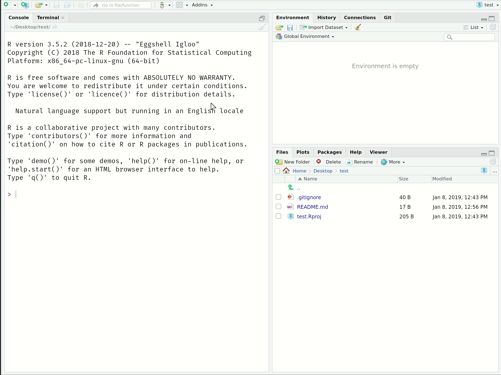
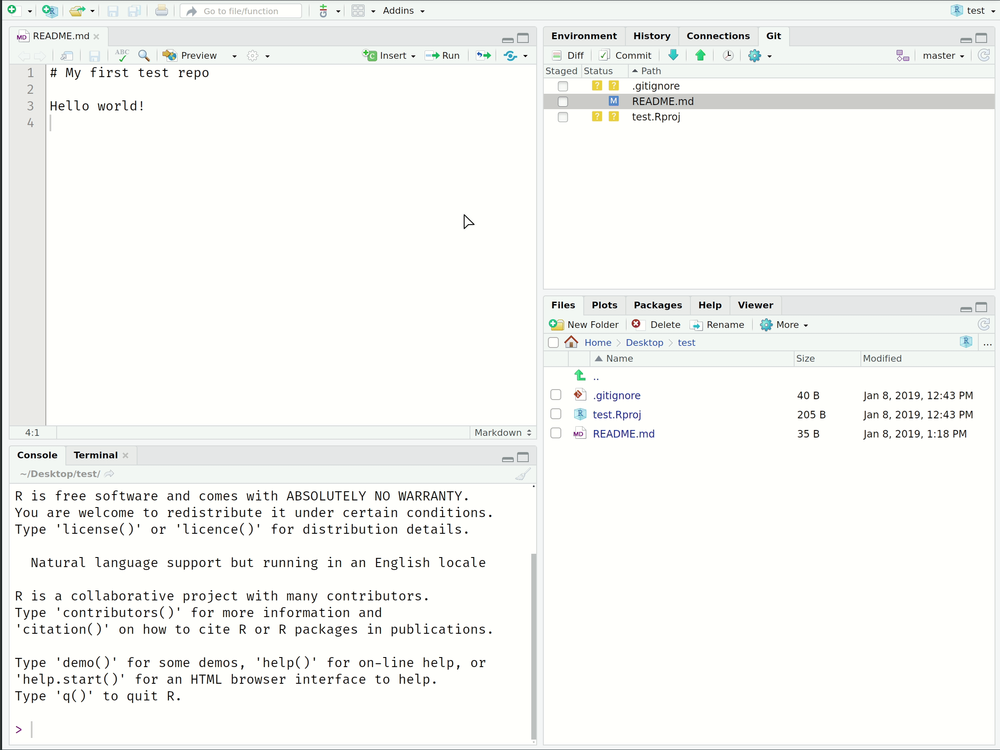
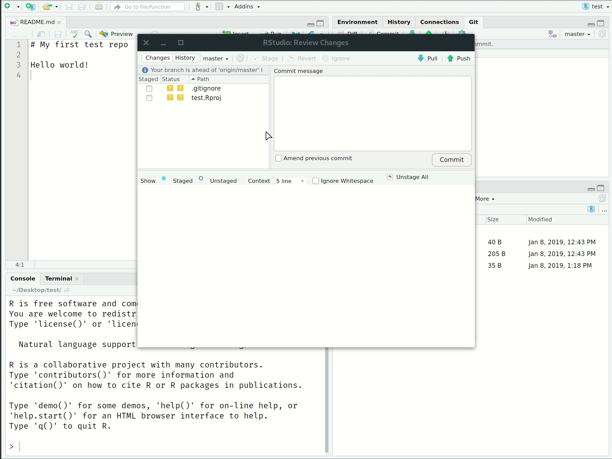
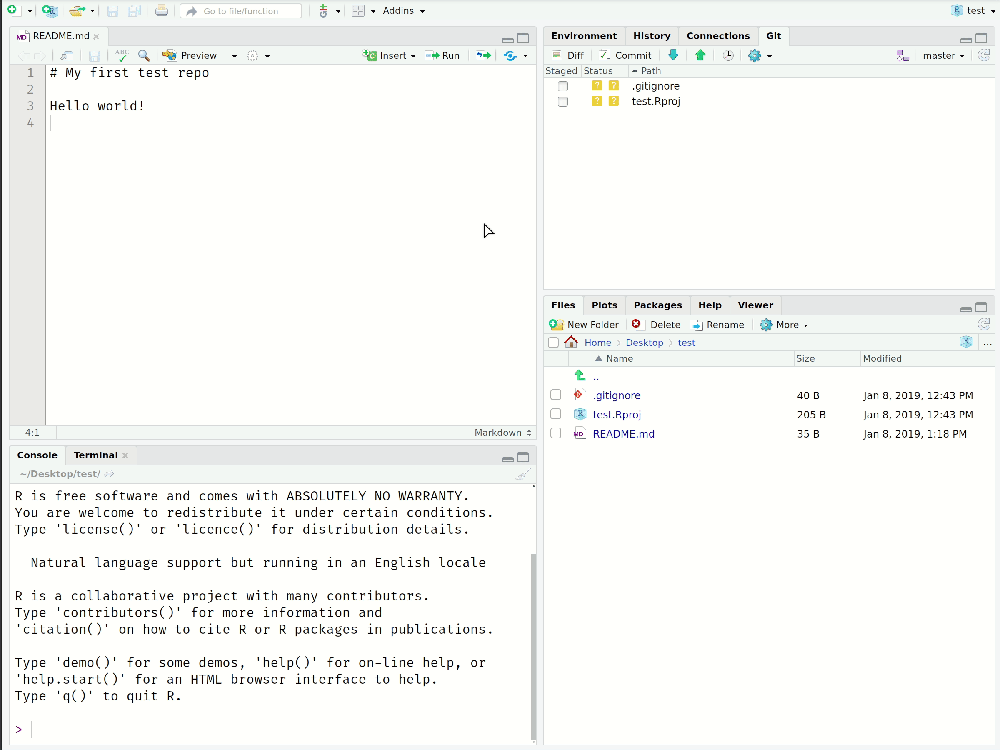

```{r setup, include=FALSE}
library(tidyverse)
library(hrbrthemes)
library(fontawesome)
```

# Why even bother?

<div align="center">

</div>

---

# Git(Hub) solves this problem

### Git

- Git is a distributed version control system.
- Okay, try this: Imagine if Dropbox and the "Track changes" feature in MS Word had a baby. Git would be that baby
- There is a learning curve, but I promise you it's worth it

### GitHub

- It's important to realize that Git and GitHub are distinct things.
- GitHub is an online hosting platform that provides an array of services built on top of the Git system. (Similar platforms include Bitbucket and GitLab)
- Just like we don't *need* Rstudio to run R code, we don't *need* GitHub to use Git... But it will make our lives so much easier

---

# Git(Hub) for scientific research

### From software development...

Git and GitHub's role in global software development is not in question
- There's a high probability that your favorite app, program or package is built using Git-based tools. (RStudio is a case in point)
- Heavily used in industry too

### ... to scientific research

- Git(Hub) helps to operationalize the ideals of open science and reproducibility
- Journals have increasingly strict requirements regarding reproducibility and data access. GitHub makes this easy
- I used for research, classes, and host and maintain my website using [GitHub Pages](https://pages.github.com/) (more on this later)
- *Nature:* "[Democratic databases: science on GitHub](https://www.nature.com/news/democratic-databases-science-on-github-1.20719)" (Perkel, 2016)

---
class: inverse, center, middle
name: rstudio

# Git(Hub) + RStudio

---

# Seamless integration

One of the (many) great features of RStudio is how well it integrates version control into your everyday workflow
- Even though Git is a completely separate program to R, they feel like part of the same "thing" in RStudio
- This next section is about learning the basic Git(Hub) commands and the recipe for successful project integration with RStudio

--

I also want to bookmark a general point that we'll revisit many times during this course: 
- The tools that we're using all form part of a coherent data science ecosystem
- Greatly reduces the cognitive overhead ("aggregation") associated with traditional workflows, where you have juggle multiple programs and languages at the same time

---

# Link a GitHub repo to an RStudio Project 

The starting point for our workflow is to link a GitHub repository (i.e. "repo") to an RStudio Project. Here are the steps we're going to follow:

1. Create the repo on GitHub and initialize with a README
2. Copy the HTTPS/SSH link (the green "Clone or Download" button)<sup>1</sup>
3. Open up RStudio
4. Navigate to **File -> New Project -> Version Control -> Git**
5. Paste your copied link into the "Repository URL:" box.
6. Choose the project path ("Create project as subdirectory of:") and click **Create Project**

.footnote[<sup>1</sup> It's easiest to start with HTTPS, but <a href="http://happygitwithr.com/ssh-keys.html#ssh-keys" target="_blank">SSH</a> is advised for more advanced users.]

--

</br>
Now, I want you to practice by these steps by creating your own repo on GitHub — call it "test" — and cloning it via an RStudio Project

---

# Make some local changes

Look at the top-right panel in your RStudio IDE. Do you see the "Git" tab? 
- Click on it 
- There should already be some files in there, which we'll ignore for the moment<sup>1</sup>

Now open up the README file (see the "Files" tab in the bottom-right panel)
- Add some text like "Hello World!" and save the README
- Do you see any changes in the "Git" panel? Good. (Raise your hand if not)

See my GIF walkthrough on the next slide...

.footnote[<sup>1</sup> They're important, but not for the purposes of this section.]

---

# Make some local changes 

<div align="center">

</div>

---

# Main Git operations

Now that you've cloned your first repo and made some local changes, it's time to learn the four main Git operations

1. **Stage** (or "add")
  - Tell Git that you want to add changes to the repo history (file edits, additions, deletions, etc.)
2. **Commit**
  - Tell Git that, yes, you are sure these changes should be part of the repo history
3. **Pull**
  - Get any new changes made on the GitHub repo (i.e. the upstream remote), either by your collaborators or you on another machine
4. **Push**
  - Push any (committed) local changes to the GitHub repo

--

For the moment, it will be useful to group the first two operations and last two operations together. (They are often combined in practice too, although you'll soon get a sense of when and why they should be split up.)

--

Ready for more GIFs?

---

# Stage and Commit

<div align="center">

</div>

--

Note the helpful commit message to ourselves

---

# Push and Pull

<div align="center">

</div>

--

See [here](https://ohi-science.org/manual/#rpostback-askpass-error) if you get `Error: unable to read askpass response from 'rpostback-askpass'`.

---

# Recap

Here's a step-by-step summary of what we just did.
- Made same changes to a file and saved them locally
- *Staged* these local changes
- *Committed* these local changes to our Git history with a helpful message
- *Pulled* from the GitHub repo just in case anyone else made changes too (not expected here, but good practice)
- *Pushed* our changes to the GitHub repo

</br>

NB aside: Always pull from the upstream repo *before* you push any changes. Seriously, do this even on solo projects; making it a habit will save you headaches down the road

--

PS — You were likely challenged for your GitHub credentials at some point. Learn how to cache these [here](https://happygitwithr.com/credential-caching.html)

--

PPS — Speaking of credentials, an even better approach is to [switch to SSH](https://happygitwithr.com/ssh-keys.html). I recommend you do this once you feel comfortable with the main Git operations

---

# Why this workflow?

Creating the repo on GitHub first means that it will always be "upstream" of your (and any other) local copies
- In effect, this allows GitHub to act as the central node in the distributed VC network
- Especially valuable when you are collaborating on a project with others — more on this later — but also has advantages when you are working alone
- If you would like to move an existing project to GitHub, my advice is still to create an empty repo there first, clone it locally, and then copy all your files across

RStudio Projects are great
- Again, they interact seamlessly with Git(Hub), as we've just seen

---
class: inverse, center, middle
name: shell

# Git from the shell

---

# Why bother with the shell?

The GitHub + RStudio Project combo is ideal for new users
- RStudio's Git integration and built-in GUI cover all the major operations
- RStudio Projects FTW

However, I want to go over Git <a href="http://happygitwithr.com/ssh-keys.html#shell" target="_blank">shell</a> commands so that you can internalise the basics
- The shell is more powerful and flexible. Does some things that the RStudio Git GUI can't
- Potentially more appropriate for projects that aren't primarily based in R. (Although, no real harm in using RStudio Projects to clone a non-R repo)

--

(Yes, we're going to cover the shell in depth next lecture, but think of this as a sneak preview)

---

# Main Git shell commands

Clone a repo.
```bash
$ git clone REPOSITORY-URL
```

See the commit history (hit spacebar to scroll down or q to exit)
```bash
$ git log
```

What has changed? 
```bash
$ git status
```
---

# Main Git shell commands (cont.)

Stage ("add") a file or group of files
```bash
$ git add NAME-OF-FILE-OR-FOLDER
```

You can use [wildcard](https://ryanstutorials.net/linuxtutorial/wildcards.php) characters to stage a group of files (e.g. sharing a common prefix). There are a bunch of useful flag options too:

- Stage all files.
```bash
$ git add -A
```
- Stage updated files only (modified or deleted, but not new)
```bash
$ git add -u
```
- Stage new files only (not updated)
```bash
$ git add .
```

---

# Main Git shell commands (cont.)

Commit your changes
```bash
$ git commit -m "Helpful message"
```

Pull from the upstream repository (i.e. GitHub)
```bash
$ git pull
```

Push any local changes that you've committed to the upstream repo (i.e. GitHub)
```bash
$ git push
```

---
class: inverse, center, middle
name: merge

# Merge conflicts
<html><div style='float:left'></div><hr color='#EB811B' size=1px width=796px></html>

---

# Collaboration time 

Turn to the person next to you. You are now partners. (Congratulations)

- P1: Invite P2 to join you as a collaborator on the "test" GitHub repo that you created earlier. (See the *Settings* tab of your repo)

- P2: Clone P1's repo to your local machine.<sup>1</sup> Make some edits to the README (e.g. delete lines of text and add your own). Stage, commit and push these changes

- P1: Make your own changes to the README on your local machine. Stage, commit and then try to push them (*after* pulling from the GitHub repo first)

.footnote[<sup>1</sup> Change into a new directory first or give it a different name to avoid conflicts with your own "test" repo. Don't worry, Git tracking will still work if you change the repo name locally]

--

Did P1 encounter a `merge conflict` error? 
- Good, that's what we were trying to trigger
- Now, let's learn how to fix them

---

# Merge conflicts

Let's confirm what's going on
```bash
$ git status
```

As part of the response, you should see something like:
```bash
Unmerged paths:
  (use "git add <file>..." to mark resolution)

   * both modified:   README.md 
```
Git is protecting P1 by refusing the merge. It wants to make sure that you don't accidentally overwrite all of your changes by pulling P2's version of the README.
- In this case, the source of the problem was obvious. Once we start working on bigger projects, however, `git status` can provide a helpful summary to see which files are in conflict

---

# Merge conflicts (cont.)

Okay, let's see what's happening here by opening up the README file. RStudio is a good choice, although your preferred text editor is fine.<sup>1</sup>

You should see something like:
```bash
# README
Some text here.
<<<<<<< HEAD
Text added by Partner 2.
=======
Text added by Partner 1.
>>>>>>> 814e09178910383c128045ce67a58c9c1df3f558.
More text here.
```

.footnote[<sup>1</sup> Other good choices are <a href="https://code.visualstudio.com/" target="_blank">VS Code</a> or <a href="https://atom.io/" target="_blank">Atom</a>, which both support native Git(Hub) integration. You can set your preferred default editor with `$ git config --global core.editor "PREFERRED_EDITOR"`.]

---

# Merge conflicts (cont.)

What do these symbols mean?

```bash
# README
Some text here.
<<<<<<< HEAD
Text added by Partner 2.
=======
Text added by Partner 1.
>>>>>>> 814e09178910383c128045ce67a58c9c1df3f558.
More text here.
```

---
count: false

# Merge conflicts (cont.)

What do these symbols mean?

```bash
# README
Some text here.
*<<<<<<< HEAD
Text added by Partner 2.
=======
Text added by Partner 1.
>>>>>>> 814e09178910383c128045ce67a58c9c1df3f558.
More text here.
```

- `<<<<<<< HEAD` Indicates the start of the merge conflict.

---
count: false

# Merge conflicts (cont.)

What do these symbols mean?

```bash
# README
Some text here.
<<<<<<< HEAD
Text added by Partner 2.
*=======
Text added by Partner 1.
>>>>>>> 814e09178910383c128045ce67a58c9c1df3f558.
More text here.
```

- `<<<<<<< HEAD` Indicates the start of the merge conflict
- `=======` Indicates the break point used for comparison

---
count: false

# Merge conflicts (cont.)

What do these symbols mean?

```bash
# README
Some text here.
<<<<<<< HEAD
Text added by Partner 2.
=======
Text added by Partner 1.
*>>>>>>> 814e09178910383c128045ce67a58c9c1df3f558.
More text here.
```

- `<<<<<<< HEAD` Indicates the start of the merge conflict
- `=======` Indicates the break point used for comparison
- `>>>>>>> <long string>` Indicates the end of the lines that had a merge conflict

---

# Merge conflicts (cont.)

Fixing these conflicts is a simple matter of (manually) editing the README file
- Delete the lines of the text that you don't want
- Then, delete the special Git merge conflict symbols

Once that's done, you should be able to stage, commit, pull and finally push your changes to the GitHub repo without any errors

--

Caveats
- P1 gets to decide what to keep because they fixed the merge conflict.
- OTOH, the full commit history is preserved, so P2 can always recover their changes if desired.
- A more elegant and democratic solution to merge conflicts (and repo changes in general) is provided by Git **branches**. We'll get there next

---

# Aside: Line endings and different OSs

### Problem

During your collaboration, you may have encountered a situation where Git is highlighting differences on seemingly unchanged sentences
- If that is the case, check whether your partner is using a different OS to you

The "culprit" is the fact that Git evaluates an invisible character at the end of every line. This is how Git tracks changes. (More info [here](https://help.github.com/articles/dealing-with-line-endings/) and [here](https://en.wikipedia.org/wiki/Newline).)
- For Linux and MacOS, that ending is "LF"
- For Windows, that ending is "CRLF"

---

# Aside: Line endings and different OSs (cont.)


### Solution
Open up the shell and enter:
```bash
$ git config --global core.autocrlf input
```
(Windows users: Change `input` to `true`).

---
class: inverse, center, middle
name: branches

# Branches and forking
<html><div style='float:left'></div><hr color='#EB811B' size=1px width=796px></html>

---

# What are branches and why use them?

Branches are one of Git's coolest features
- Allow you to take a snapshot of your existing repo and try out a whole new idea *without affecting* your main (i.e. "master") branch
- Only once you (and your collaborators) are 100% satisfied, would you merge it back into the master branch
  - This is how most new features in modern software and apps are developed
  - It is also how bugs are caught and fixed
  - But researchers can easily — and should! — use it to try out new ideas and analysis (e.g. robustness checks, revisions, etc.)
- If you aren't happy, then you can just delete the experimental branch and continue as if nothing happened

---

# Create a new branch in RStudio

<div align="center">

</div>

---

# Branch shell commands

Create a new branch on your local machine and switch to it:
```bash
$ git checkout -b NAME-OF-YOUR-NEW-BRANCH
```

Push the new branch to GitHub:
```bash
$ git push origin NAME-OF-YOUR-NEW-BRANCH
```

List all branches on your local machine:
```bash
$ git branch
```

Switch back to (e.g.) the master branch:
```bash
$ git checkout main
```

Delete a branch
```bash
$ git branch -d NAME-OF-YOUR-FAILED-BRANCH
$ git push origin :NAME-OF-YOUR-FAILED-BRANCH
```

---

# Merging branches + Pull requests

You have two options:

### 1. Locally
- Commit your final changes to the new branch (say we call it "new-idea").
- Switch back to the master branch: `$ git checkout master`
- Merge in the new-idea branch changes: `$ git merge new-idea`
- Delete the new-idea branch (optional): `$ git branch -d new-idea`
  
### 2. Remotely (i.e. *pull requests* on GitHub)
- PRs are a way to notify collaborators — or yourself! — that you have completed a feature.
- You write a summary of all the changes contained in the branch.
- You then assign suggested reviewers of your code — including yourself potentially — who are then able to approve these changes ("Merge pull request") on GitHub.
- Let's practice this now in class...

---

# Your first pull request

You know that "new-idea" branch we just created a few slides back? Switch over to it if you haven't already
- Remember: `$ git checkout new-idea` (or just click on the branches tab in RStudio)

Make some local changes and then commit + push them to GitHub
- The changes themselves don't really matter. Add text to the README, add some new files, whatever

After pushing these changes, head over to your repo on GitHub
- You should see a new green button with "Compare & pull request". Click it
- Add a meta description of what this PR accomplishes. You can also change the title if you want
- Click "Create pull request"
- (Here's where you or your collaborators would review all the changes)
- Once satisfied, click "Merge pull request" and then confirm

???

See instructions <a href="https://help.github.com/articles/creating-a-pull-request/" target="_blank">here</a>.

---

# Your first pull request (cont.)

<div align="center">

</div>

---

# Forks

Git forks lie somewhere between cloning a repo and branching from it
- In fact, if you fork a repo then you are really creating a copy of it

Forking a repo on GitHub is [very simple](https://help.github.com/articles/fork-a-repo/); just click the "Fork" button in the top-right corner of said repo
- This will create an independent copy of the repo under your GitHub account
<!-- - Try this now. Use one of [my repos](https://github.com/grantmcdermott?tab=repositories) if you can't think of anyone else's -->

Once you fork a repo, you are free to do anything you want to it. (It's yours.) However, forking — in combination with pull requests — is actually how much of the world's software is developed. For example:
- Outside user *B* forks *A*'s repo. She adds a new feature (or fixes a bug she's identified) and then [issues an upstream pull request](https://help.github.com/articles/creating-a-pull-request-from-a-fork/)
- *A* is notified and can then decide whether to merge *B*'s contribution with the main project

---

# Forks (cont.)

Creating forks is super easy as we've just seen. However, maintaining them involves some more leg work if you want to stay up to date with the original repo.
- GitHub: "[Syncing a fork](https://help.github.com/articles/syncing-a-fork/)"
- This isn't going to be an issue for completed projects. E.g. Forking the repo that contains the code and data of a published paper

---
class: inverse, center, middle
name: other

# Other tips
<!-- <html><div style='float:left'></div><hr color='#EB811B' size=1px width=796px></html> -->

---

# README

README files are special in GitHub because they act as repo landing pages
- For a project tied to a research paper, this is where you should be explicit about the goal of the research paper, the software requirements, how to run the analysis, and so forth
- On the other end of the scale, many GitHub repos are basically standalone README files. Think of these as version-controlled blog posts (e.g. [here](https://github.com/jfiksel/github-classroom-for-teachers)) 

README files can also be added to the *sub-directories* of a repo, where they will act as a landing pages too
- Particularly useful for bigger projects. Say, where you are using multiple programming languages (e.g. [here](https://github.com/grantmcdermott/blueparadox)), or want to add more detail about a dataset (e.g. [here](https://github.com/grantmcdermott/sceptic-priors/tree/master/data))

READMEs should be written in Markdown, which GH automatically renders
- We'll learn more about [Markdown](https://www.markdownguide.org/) (and its close relation, [R Markdown](https://rmarkdown.rstudio.com/)) during the course

---

# .gitignore

A .gitignore file tells Git what to — *wait for it* — ignore

This is especially useful if you want to exclude whole folders or a class of files (e.g. based on size or type)
- Proprietary data files should be ignored from the beginning if you intend to make a repo public at some point
- Very large individual files (>100 MB) exceed GitHub's maximum allowable size and should be ignored regardless. See <a href="https://help.github.com/articles/working-with-large-files/" target="_blank">here</a> and <a href="https://help.github.com/articles/versioning-large-files/" target=_"blank">here</a>

I typically add compiled datasets to my .gitignore in the early stages of a project.
- Reduces redundant version control history, where the main thing is the code that produces the compiled dataset, not the end CSV in of itself. ("Source is real.")
- Simple to remove from my .gitignore once the project is being finalized (e.g. paper is being submitted)
  
---

# .gitignore (cont.)

You can create a .gitignore file in multiple ways.

- A .gitignore file was automatically generated if you cloned your repo with an RStudio Project
- You could also have the option of adding one when you first create a repo on GitHub
- Or, you can create one with your preferred text editor. (Must be saved as ".gitignore")

Once the .gitignore file is created, simply add in lines of text corresponding to the files that should be ignored

- To ignore a single a file: `FILE-I-WANT-TO-IGNORE.csv`
- To ignore a whole folder (and all of its contents, subfolders, etc.): `FOLDER-NAME/**`
- The standard shell commands and special characters apply
  - E.g. Ignore all CSV files in the repo: `*.csv`
  - E.g. Ignore all files beginning with "test": `test*`
  - E.g. Don't ignore a  particular file: `!somefile.txt`

---

# GitHub Issues

[GitHub Issues](https://guides.github.com/features/issues/) are another great way to interact with your collaborators and/or package maintainers
- If you spot any problems with these lecture notes, please file an issue [here](https://github.com/dadepro/mkt-615/issues)!

---
#GitHub Pages

### Hosting webpages using GitHub
GitHub can also be used to host your personal webpage using [GitHub Pages](https://pages.github.com/)
- e.g., my [webisite](https://dadepro.github.io/)

---
class: inverse, center, middle
name: summary

# Summary
---

# Recipe (shell commands in grey)

1. Create a repo on GitHub and initialize with a README.

2. Clone the repo to your local machine. Preferably using an RStudio Project, but as you wish. (E.g. Shell command: `$ git clone REPOSITORY-URL`)

3. Stage any changes you make: `$ git add -A`

4. Commit your changes: `$ git commit -m "Helpful message"`

5. Pull from GitHub: `$ git pull`

6. (Fix any merge conflicts.)

7. Push your changes to GitHub: `$ git push`

--

Repeat steps 3—7 (but especially steps 3 and 4) often.

---

# Coming up

### Get the course materials

If you haven't done so already, now is a good time to clone/fork the course materials to your local computer.

<!-- ### Assignment 1 -->

<!-- Now that you've learned the necessary basics, Assignment 1 is up on GitHub Classroom. -->
<!-- - Impress me with your ggplot2 skills. -->
<!-- - Deadline: Due by the *start* of our next lecture. -->


### Next lecture

The shell

---
class: inverse, center, middle
name: faq

# Appendix: FAQ
---

# FAQ

**Q: When should I commit (and push) changes?**

**A: Early and often.**
- It's not quite as important as saving your work regularly, but it's a close second.
- You should certainly push everything that you want your collaborators to see.
  
**Q: Do I need branches if I am working on a solo project?**

**A: You don't *need* them, but they offer big advantages in maintaining a sane workflow.**
- Experiment without any risk to the main project!
- If you combine them with pull requests, then you can compress significant additions to your project (which may comprise many small edits) into a single branch.

---

# FAQ (cont.)

**Q: What's the difference between cloning and forking a repo?**

**A: Cloning directly ties your local version to the original repo, while forking creates a copy on your GitHub (which you can then clone).**
- <a href="http://happygitwithr.com/clone.html" target="_blank">Cloning</a> makes it easier to fetch updates (and is often the best choice for new GitHub users), but <a href="http://happygitwithr.com/fork.html" target="_blank">forking</a> has advantages too.

**Q: What happens when something goes wrong?**

**A: Think: "Oh shit, Git!"**
- Seriously: http://ohshitgit.com/.
  
**Q: What happens when something goes <i>horribly</i> wrong?**

**A: Burn it down and start again.**
- http://happygitwithr.com/burn.html
- This is a great advantage of Git's distributed nature. If something goes horribly wrong, there's usually an intact version somewhere else.
