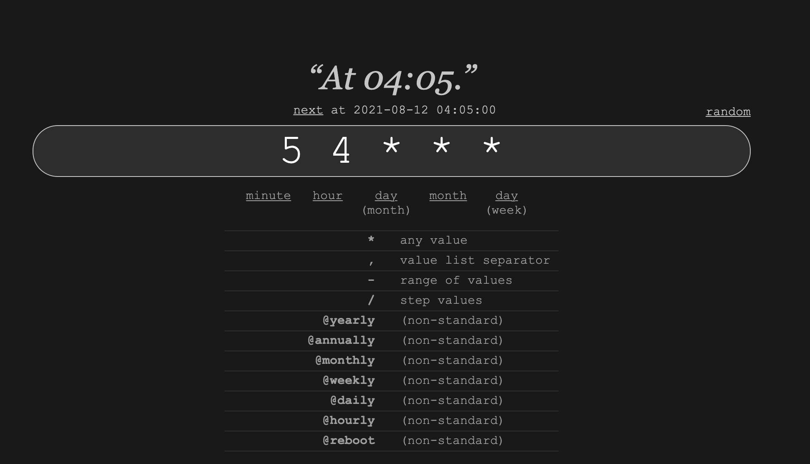
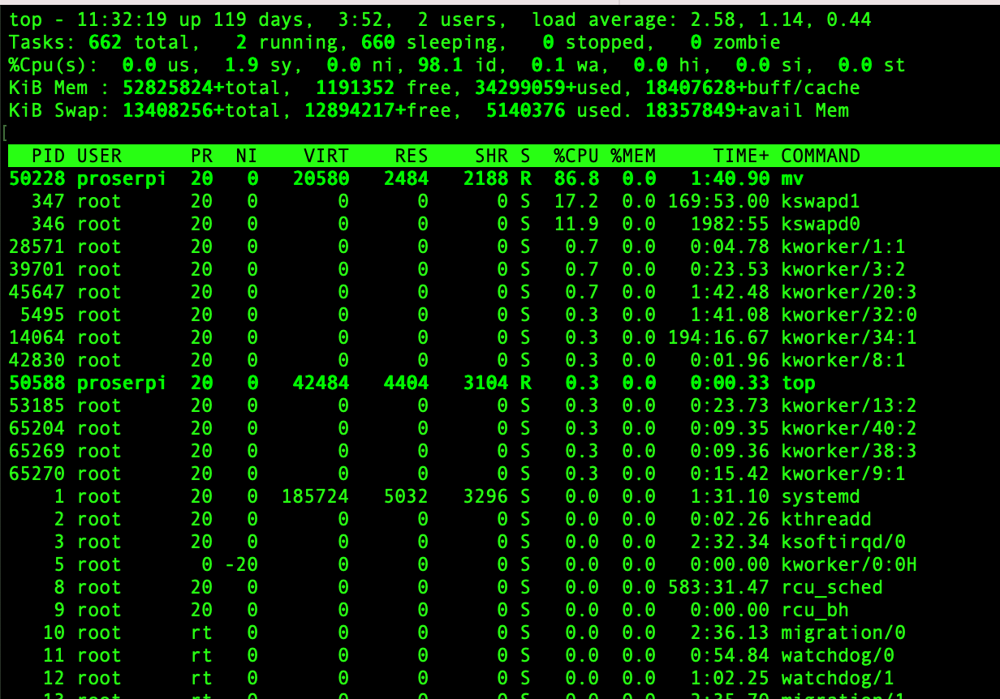

```{r setup, include=FALSE}
library(tidyverse)
library(hrbrthemes)
library(fontawesome)
```
# Table of contents


1. [Introduction](#intro)

2. [Bash shell basics](#basics)

3. [SSH](#remote)

3. [Files and directories](#files)

4. [Working with text files](#text)

5. [Redirecting and pipes](#pipes)

6. [Scripting](#scripting)

7. [User roles and file permissions](#permissions)

8. [Vim](#vim)

9. [Running scripts](#running)

10. [Monitor resources](#monitor)

11. [Appendix (Windows users only)](#windows)

---

name:start
# Checklist

☑ Have you cloned the [course repo](https://github.com/dadepro/mkt-615) to your local machine?

☑ Do you have Bash-compatible shell? You should be ok with Mac and Linux, **Windows** users: see [here](#windows) before continuing (or you can decide to use **mshresearch** and [RStudio Server](http://mshresearch.marshall.usc.edu:8787/) ready for your to use)


</br>

(This lecture is the last detour before we get back to data analyis with R and RStudio.)

---
class: inverse, center, middle
name: intro

# Introduction
<!-- <html><div style='float:left'></div><hr color='#EB811B' size=1px width=796px></html> -->

---

# Definitions

Don't be thrown off by terminology: *shell*, *terminal*, *tty*, *command prompt*, etc. 
- These are all basically just different names for the same thing.<sup>1</sup>
- They are all referring to a **command line interface** (CLI).

.footnote[
<sup>1</sup> [Truth be told](https://unix.stackexchange.com/questions/4126/what-is-the-exact-difference-between-a-terminal-a-shell-a-tty-and-a-con), there are some subtle and sometimes important differences, as well as some interesting history behind the names. But we can safely ignore these here.
]

--

There are many shell variants, but we're going to focus on [**Bash**](https://www.gnu.org/software/bash/) (i.e. **B**ourne **a**gain **sh**ell).
- Included by default on Linux and MacOS.
- Windows users need to install a Bash-compatible shell first (again, see [here](#windows)).

--

(For the record, MacOS default shell is now [zsh](https://ohmyz.sh/) (i.e. the "Z shell"). As a result, my shell might look slightly different to yours during live coding sessions. The commands will stay the same, though.)

---

# Why even bother with the shell?

1. Power
  - Both for executing commands and for fixing problems. There are some things you just can't do in an IDE or GUI.
  <!-- - It also avoids memory complications associated with certain applications and/or IDEs. We'll get to this issue later in the course. -->

2. Reproducibility
 - Scripting is reproducible, while clicking is not.

3. Interacting with servers and high-performance computers
  - The shell is often the only option for high performance computing. We'll get to this later in the course.

4. Automating workflow and analysis pipelines
  - Easily track and reproduce an entire project (e.g. use a Makefile to combine multiple programs, scripts, etc.)

---
# What do I use the shell for?

- Git/SVN

- Running scripts (Python, Bash scripts, R, etc.)

- Managing mshresearch (creating users, monitoring resources, etc.)

- Installing software

- Schedule tasks ([Crontab](https://crontab.guru/))

- File management (renaming, moving, etc.)

- Probably more things I am forgetting about


---
class: inverse, center, middle
name: basics

# Bash shell basics
<!-- <html><div style='float:left'></div><hr color='#EB811B' size=1px width=796px></html> -->

---

# First look

Let's open up our Bash shell. 

- [Linux](https://www.wikihow.com/Open-a-Terminal-Window-in-Ubuntu)
- [Mac](https://www.techwalla.com/articles/how-to-open-terminal-on-a-macbook)
- [Windows](https://www.howtogeek.com/265900/everything-you-can-do-with-windows-10s-new-bash-shell/)

You can also use RStudio if you prefer:
- [RStudio's built-in Terminal](https://support.rstudio.com/hc/en-us/articles/115010737148-Using-the-RStudio-Terminal).

---

# First look (cont.)

You should see something like:

```bash
 username@hostname:~$
```

This is shell-speak for: "Who am I and where am I?"

--

- `username` denotes a specific user (one of potentially many on this computer). 

--

- `@hostname` denotes the name of the computer or server.

--

- `:~` denotes the directory path (where `~` signifies the user's home directory).

--

- `$` denotes the start of the command prompt.
  - We'll get to this later, but for a special "superuser" called root, the dollar sign will change to a `#`.

---

# Useful keyboard shortcuts

- `Tab` completion.

- Use the `↑` (and `↓`) keys to scroll through previous commands.

- `Ctrl`+`→` (and `Ctrl`+`←`) to skip whole words at a time.

- `Ctrl`+`a` moves the cursor to the beginning of the line.

- `Ctrl`+`e` moves the cursor to the end of the line.

- `Ctrl`+`k` deletes everything to the right of the cursor.

- `Ctrl`+`u` deletes everything to the left of the cursor.

- `Ctrl`+`Shift`+`c` to copy and `Ctrl`+`Shift`+`v` to paste (I think `shift` is optional)

- `clear` to clear your terminal.

---

# Syntax

All Bash commands have the same basic syntax:

**<center>command option(s) argument(s)</center>**

Examples:

  ```bash
  $ ls -lh ~/Documents/
  ```
  ```bash
  $ sort -u myfile.txt
  ```

---
count: false

# Syntax

All Bash commands have the same basic syntax:

**<center><span style='background: #ffff88;'>command</span> option(s) argument(s)</center>**

Examples:

  ```bash
  $ `ls` -lh ~/Documents/
  ```
  ```bash
  $ `sort` -u myfile.txt
  ```

---
count: false

# Syntax

All Bash commands have the same basic syntax:

**<center>command <span style='background: #ffff88;'>option(s)</span> argument(s)</center>**

Examples:

  ```bash
  $ ls `-lh` ~/Documents/
  ```
  ```bash
  $ sort `-u` myfile.txt
  ```


---
count: false

# Syntax

All Bash commands have the same basic syntax:

**<center>command option(s) <span style='background: #ffff88;'>argument(s)</span></center>**

Examples:

  ```bash
  $ ls -lh `~/Documents/`
  ```
  ```bash
  $ sort -u `myfile.txt`
  ```

---

# Syntax

All Bash commands have the same basic syntax:

**<center>command option(s) argument(s)</center>**

Examples:

  ```bash
  $ ls -lh ~/Documents/
  ```
  ```bash
  $ sort -u myfile.txt
  ```

</br>

**commands**
- You don't always need options or arguments. (E.g. `$ ls ~/Documents/` and `$ ls -lh` are both valid commands that will yield output.)
- However, you always need a command.

---

# Syntax (cont.)

**options** (also called **flags**)
- Start with a dash.
- Usually one letter.
- Multiple options can be chained together under a single dash.
  ```bash
  $ ls -l -a -h /var/log ## This works
  $ ls -lah /var/log ## So does this
  ```
- An exception is with (rarer) options requiring two dashes.
  ```bash
  $ ls --group-directories-first --human-readable /var/log
  ```

**arguments**
- Tell the command *what* to operate on.
- Usually a file, path, or a set of files and folders.

---

# Help: man

The `man` command ("manual pages") is your friend if you ever need help.
- Tip: Hit spacebar to scroll down a page at a time, "h" to see the help notes of the `man` command itself and "q" to quit.

```{bash man}
man ls
```

---

# Help: man (cont.)

A useful feature of `man` is quick pattern searching with "/pattern".
- Try this now by running `$ man ls` again and then typing "/human" and hitting the return key. 
- To continue on to the next case, hit `n`. (It won't work here because the pattern "human" only occurs once in the manual file.)

--

</br>

Again, this and other `man` tricks tricks are detailed in the help pages (hit "h").

---

# Help: cheat

I also like the [cheat](https://github.com/chrisallenlane/cheat) utility, which provides a more readable summary / cheatsheet of various command. You'll need to install it first. (Linux and MacOS only.)

```
$ cheat ls
## # Displays everything in the target directory
## ls path/to/the/target/directory
## 
## # Displays everything including hidden files
## ls -a
## 
## # Displays all files, along with the size (with unit suffixes) and timestamp
## ls -lh 
## 
## # Display files, sorted by size
## ls -S
## 
## # Display directories only
## ls -d */
## 
## # Display directories only, include hidden
## ls -d .*/ */
```


---
class: inverse, center, middle
name: remote

# Connect to a remote machine
<!-- <html><div style='float:left'></div><hr color='#EB811B' size=1px width=796px></html> -->

---
# SSH (Secure shell)

### Definition
Cryptographic network protocol for operating network services securely over an unsecured network


You will be using it to connect to computing resources (e.g., `mshresearch`), let's try:
```
# Note that you need to be on a USC network or USC VPN
ssh username@mshreserch.marshall.usc.edu
```
Once you are logged in, you are in your home, check it with `pwd` 

You should not save research projects in your home, instead use:
1. `/data/research/  (868G available)
2. `/data-2/research/ (6.9TB available)

As you don't have superuser permission (more on this later), you need to tell me to create a project dir for you

---
class: inverse, center, middle
name: files

# Files and directories
<!-- <html><div style='float:left'></div><hr color='#EB811B' size=1px width=796px></html> -->

---

# Navigation

Key navigation commands:

- `pwd` to print (the current) working directory.

- `cd` to change directory.

```{bash nav1}
pwd
```

--

You can use absolute paths, but it's better to use relative paths and invoke special symbols for a user's home folder (`~`), current directory (`.`), and parent directory (`..`) as needed. 

```{bash nav2}
cd examples ## Move into the "examples" sub-directory of this lecture directory.
cd ../.. ## Now go back up two directories.
pwd
```

---

# Navigation (cont.)

Beware of directory names that contain spaces. Say you have a directory called "My Documents". (I'm looking at you, Windows.)

- Why won't `$ cd My Documents` work?

--

**Answer:** Bash syntax is super pedantic about spaces and ordering. Here it thinks that "My" and "Documents" are separate arguments.

--
Solutions:
  - Use quotation marks: `$ cd "My Documents"`.

  - Use Tab completion to automatically "escape" the space: `$ cd My\ Documents`. 
  
  - **Don't use spaces in file and folder names**

---

# Listing files and their properties

We're about to go into more depth about the `ls` command.
- To do this effectively, it will be helpful if we're all working off the same group of files and folders.
- Navigate to the directory containing these lecture notes (i.e. `03-shell`). Now list the contents of the  `examples/` sub-directory with the `-lh` option ("long format", "human readable").

```{bash ls}
# cd PathWhereYouClonedThisRepo/lectures/03-shell ## change as needed
ls -lh examples
```

---

# Listing files and their properties (cont.)

What does this all mean? Let's focus on the top line.

```bash
drwxr-xr-x 2 dproserp staff 4.0K Jan 12 22:12 ABC
```

---
count:false

# Listing files and their properties (cont.)

What does this all mean? Let's focus on the top line.

<p span style="font-family:Fira Code; font-size:80%; color: #333; background: #f8f8f8; padding: 0.5em;";>
<span style='background: #ffff88;'>d</span>rwxr-xr-x 2 grant users 4.0K Jan 12 22:12 ABC</span>

- The first column denotes the object type:
  - `d` (directory or folder), `l` (link), or `-` (file)

---

count:false

# Listing files and their properties (cont.)

What does this all mean? Let's focus on the top line.

<p span style="font-family:Fira Code; font-size:80%; color: #333; background: #f8f8f8; padding: 0.5em;";>d<span style='background: #ffff88;'><span style='color: #e41a1c;'>rwx</span><span style='color: #377eb8;'>r-x</span><span style='color: #4daf4a;'>r-x</span></span> 2 grant users 4.0K Jan 12 22:12 ABC</span>

- <span style='color: #A9A9A9;'>The first column denotes the object type:
  - `d` (directory or folder), `l` (link), or `-` (file)</span>
- Next, we see the permissions associated with the object's three possible user types: 1) <span style='color: #e41a1c;'>owner</span>, 2) <span style='color: #377eb8;'>the owner's group</span>, and 3) <span style='color: #4daf4a;'>all other users</span>.
  - Permissions reflect `r` (read), `w` (write), or `x` (execute) access.
  - <b>`-`</b> denotes missing permissions for a class of operations.

---
count:false

# Listing files and their properties (cont.)

What does this all mean? Let's focus on the top line.

<p span style="font-family:Fira Code; font-size:80%; color: #333; background: #f8f8f8; padding: 0.5em;";>drwxr-xr-x <span style='background: #ffff88;'>2</span> grant users 4.0K Jan 12 22:12 ABC</span>

- <span style='color: #A9A9A9;'>The first column denotes the object type:
  - `d` (directory or folder), `l` (link), or `-` (file)</span>
- <span style='color: #A9A9A9;'>Next, we see the permissions associated with the object's three possible user types: 1) owner, 2) the owner's group, and 3) all other users.
  - Permissions reflect `r` (read), `w` (write), or `x` (execute) access.
  - <b>`-`</b> denotes missing permissions for a class of operations.</span>
- The number of [hard links](http://www.giannistsakiris.com/2011/04/15/counting-and-listing-hard-links-on-linux/) to the object.

---

count:false

# Listing files and their properties (cont.)

What does this all mean? Let's focus on the top line.

<p span style="font-family:Fira Code; font-size:80%; color: #333; background: #f8f8f8; padding: 0.5em;";>drwxr-xr-x 2 <span style='background: #ffff88;'><span style='color: #e41a1c;'>grant</span> <span style='color: #377eb8;'>users</span></span> 4.0K Jan 12 22:12 ABC</span>

- <span style='color: #A9A9A9;'>The first column denotes the object type:
  - `d` (directory or folder), `l` (link), or `-` (file)</span>
- <span style='color: #A9A9A9;'>Next, we see the permissions associated with the object's three possible user types: 1) owner, 2) the owner's group, and 3) all other users.
  - Permissions reflect `r` (read), `w` (write), or `x` (execute) access.
  - <b>`-`</b> denotes missing permissions for a class of operations.</span>
- <span style='color: #A9A9A9;'>The number of hard links to the object.</span>
- We also see the identity of the object's <span style='color: #e41a1c;'>owner</span> and their <span style='color: #377eb8;'>group</span>.

---
count:false

# Listing files and their properties (cont.)

What does this all mean? Let's focus on the top line.

<p span style="font-family:Fira Code; font-size:80%; color: #333; background: #f8f8f8; padding: 0.5em;";>drwxr-xr-x 2 grant users <span style='background: #ffff88;'>4.0K Jan 12 22:12 ABC</span></span>

- <span style='color: #A9A9A9;'>The first column denotes the object type:
  - `d` (directory or folder), `l` (link), or `-` (file)</span>
- <span style='color: #A9A9A9;'>Next, we see the permissions associated with the object's three possible user types: 1) owner, 2) the owner's group, and 3) all other users.
  - Permissions reflect `r` (read), `w` (write), or `x` (execute) access.
  - <b>`-`</b> denotes missing permissions for a class of operations.</span>
- <span style='color: #A9A9A9;'>The number of hard links to the object.</span>
- <span style='color: #A9A9A9;'>We also see the identity of the object's owner and their group.</span>
- Finally, we see some descriptive elements about the object: 
  - Size, date and time of creation, and the object name.

---

# Create: touch and mkdir

One of the most common shell tasks is object creation (files, directories, etc.)

We use `mkdir` to create directories. E.g. To create a new "testing" directory:
```{bash mkdir}
rm -fR testing
mkdir testing
```

We use `touch` to create (empty) files. E.g. To add some files to our new directory:
```{bash touch}
# remove if file exist before creating it
rm -f testing/test1.txt testing/test2.txt testing/test3.txt
touch testing/test1.txt testing/test2.txt testing/test3.txt
```

--

Check that it worked:
```{bash}
ls testing
```

---

# Copy: cp

The syntax for copying is `$ cp object path/copyname`
- If you don't provide a new name for the copied object, it will just take the old name.
- However, if there is already an object with the same name in the target destination, then you'll have to use `-f` to force an overwrite.

```{bash cp}
## Create new "copies" sub-directory
mkdir examples/copies
## Now copy across a file (with a new name)
cp examples/reps.txt examples/copies/reps-copy.txt
## Show that we were successful
ls examples/copies
```

--

You can use `cp` to copy directories, although you'll need the `-r` (or `-R`) flag if you want to recursively copy over everything inside of it to. 
- Try this by copying over the `meals/` sub-directory to `copies/`.

---

# Move (and rename): mv 

The syntax for moving is `$ mv object path/newobjectname` 

```{bash mv1}
 ## Move the abc.txt file and show that it worked
mv examples/ABC/abc.txt examples
ls examples/ABC ## empty
```
```{bash mv2}
## Move it back again
mv examples/abc.txt examples/ABC
ls examples/ABC ## not empty
```

--

Note that "moving" an object within the same directory, but with the (newobjectname) option, is effectively the same as renaming it.

```{bash mv3}
 ## Rename reps-copy to reps2 by "moving" it with a new name
mv examples/copies/reps-copy.txt examples/copies/reps2.txt
ls examples/copies
```
---

# Find (files)

The last command that I want to mention w.r.t. navigation is `find`.
- This can be used to locate files and directories based on a variety of criteria; from pattern matching to object properties.

```{bash find1}
find examples -iname "monday.csv" ## will automatically do recursive
```

```{bash find2}
find . -iname "*.txt" ## must use "." to indicate pwd
```

---
class: inverse, center, middle
name: text

# Working with text files
<!-- <html><div style='float:left'></div><hr color='#EB811B' size=1px width=796px></html> -->

---

# Counting text: wc

You can use the `wc` command to count: 1) lines of text, 2) the number of words, and 3) the number of characters.

Let's demonstrate with a text file containing all of Shakespeare's Sonnets.<sup>1</sup>

```{bash wc}
wc examples/sonnets.txt
```

.footnote[
<sup>1</sup> Courtesy of [Project Gutenburg](http://www.gutenberg.org/cache/epub/1041/pg1041.txt).
]

---

# Find patterns: grep

To find patterns in text, we can use regular expression-type matching with `grep`. 

For example, say we want to find the famous opening line to Shakespeare's [Sonnet 18](https://en.wikipedia.org/wiki/Sonnet_18).
- I'm going to include the `-n` ("number") flag to get the line that it occurs on. 

```{bash grep1}
grep -n "Shall I compare thee" examples/sonnets.txt
```

--

By default, `grep` returns all matching patterns. 
- What happens if you run `$ grep -n "summer" examples/sonnets.txt`?
- Or, for that matter, `$ grep -n "the" examples/sonnets.txt`?


---

# Find patterns: grep (cont.)

Note that `grep` can be used to identify patterns in a group files (e.g. within a directory) too.
 - This is particularly useful if you are trying to identify a file that contain, say, a function name. 
 
Here's a simple example: Which days will I eat pasta this week? 
 - I'm using the `R` (recursive) and `l` (just list the files; don't print the output) flags.

```{bash grep2}
grep -Rl "pasta" examples/meals
```

---
class: inverse, center, middle
name: pipes

# Redirecting and pipes
<!-- <html><div style='float:left'></div><hr color='#EB811B' size=1px width=796px></html> -->

---

# Redirect: >

You can send output from the shell to a file using the redirect operator `>`

For example, let's print a message to the shell using the `echo` command.

```{bash}
echo "At first, I was afraid, I was petrified"
```

--

If you wanted to save this output to a file, you need simply redirect it to the filename of choice.

```{bash}
echo "At first, I was afraid, I was petrified" > survive.txt
find survive.txt ## Show that it now exists
```

---

# Redirect: > (cont.)

If you want to *append* text to an existing file, then you should use `>>`.
- Using `>` will try to overwrite the existing file contents.

```{bash}
echo "'Kept thinking I could never live without you by my side" >> survive.txt
cat survive.txt
```

```{bash, echo = F}
## Remove file so that we do't keep adding to it when we re-knit these slides
rm survive.txt
```

---


# Pipes: |

The pipe operator `|` lets you send (i.e. "pipe") intermediate output to another command.
- In other words, it allows us to chain together a sequence of simple operations and thereby implement a more complex operation. (Remember the Unix philosophy!)

Let me demonstrate using a very simple example:
```{bash pipe1}
find . -type f | wc -l
```
---
class: inverse, center, middle
name: scripting

# Scripting
<!-- <html><div style='float:left'></div><hr color='#EB811B' size=1px width=796px></html> -->

---

# Hello World!

Writing code and commands interactively in the shell makes a lot of sense when you are exploring data, file structures, etc.

However, it's also possible (and often desirable) to write reproducible shell scripts that combine a sequence of commands.
- These scripts are demarcated by their `.sh` file extension.

--

Let's look at the contents of a short shell script that I've included in the examples folder.

```{bash hello}
cat examples/hello.sh
```

--

I'm sure that you already have a good idea of what this script is meant to do, but it will prove useful to quickly go through some things together.

---

# Hello World! (cont.)

```bash
*#!/bin/sh
echo -e "\nHello World!\n"
```

- `#!/bin/sh` is a [shebang](https://en.wikipedia.org/wiki/Shebang_(Unix), indicating which program to run the command with (here: any Bash-compatible shell). However, it is typically ignored (note that it begins with the hash comment character.)

---
count: false

# Hello World! (cont.)

```bash
#!/bin/sh
*echo -e "\nHello World!\n"
```

- `#!/bin/sh` is a [shebang](https://en.wikipedia.org/wiki/Shebang_(Unix), indicating which program to run the command with (here: any Bash-compatible shell). However, it is typically ignored (note that it begins with the hash comment character.)
- `echo -e "\nHello World!\n"` is the actual command that we want to run.

---
count: false

# Hello World! (cont.)

```bash
#!/bin/sh
echo -e "\nHello World!\n"
```

- `#!/bin/sh` is a [shebang](https://en.wikipedia.org/wiki/Shebang_(Unix), indicating which program to run the command with (here: any Bash-compatible shell). However, it is typically ignored (note that it begins with the hash comment character.)
- `echo -e "\nHello World!\n"` is the actual command that we want to run. The `-e` flag tells bash that we want to evaluate an expression rather than a file.

To run this simple script, you can just type in the file name and press enter.

```{bash hello_run}
examples/hello.sh
# bash examples/hello.sh ## Also works
```

---
name: rscript

# Rscript

It's important to realise that we aren't limited to running shell scripts in the shell. The exact same principles carry over to other programs and files.

The most relevant case for this class is the [`Rscript`](https://stat.ethz.ch/R-manual/R-devel/library/utils/html/Rscript.html) command for (you guessed it) executing R scripts and expressions. For example:

```{bash rscript_simple}
Rscript -e "cat('Hello World, from R!')"
```

--

Of course, the more typical `Rscript` use case is to execute full length R scripts. An optional, but very useful feature here is the ability to pass extra arguments from the shell to your R script. Consider the `hello.R` script that I've bundled in the examples folder.

```{bash rscript_hello_cat}
cat examples/hello.R
```

---

# Rscript (cont.)

The key step for using additional `Rscript` arguments is held within the top two lines.

```r
args = commandArgs(trailingOnly = TRUE)
i = args[1]; j = args[2]
```
These tell Rscript to capture any trailing arguments (i.e. after the file name) and then pass them on as objects that can be used within R. 

--

Let's run the script to see it in action.

```{bash rscript_hello}
Rscript examples/hello.R 12 9
```

---
class: inverse, center, middle

# Editing files using terminal

---
name:vim 

# [Vim](https://www.vim.org/)

- Text editor that works on the terminal
- Steep curve to learn (I will give you just a brief intro here)

Open a file:
```{bash vim1, eval=FALSE}
vim examples/hello.sh
```

- Exit: `q` (exit w/o saving changes: `q!`)
- Save: `w` (save and exit: `wq`)
- To start writing (insert): `i`
- Exit from current status: Escape
- Search: `/pattern` (`n` for next occurrence)
- Delete line: `dd`
- Copy and paste line: `yyp`
- Commands start with colons and can by quite complicated, e.g.:
  `%s/Hello/Ciao/g`
---
name: running

#(More on) Running Scripts

- Let create a new script called `loop.sh` under the `examples` folder that runs a for loop from 1 to 100, printing `Loop iteration i` ** at each iteration and wait (sleep) a second between each iteration
  ```{bash, eval=FALSE}
  vim examples/loop.sh
  ```

  Try to do it yourself

--
  ```{bash, eval=FALSE}   
  #!/bin/bash
  for i in {1..100}
  do
        echo "Loop iteration $i"
        sleep 1
  done

  ```
- Now, try to run the script:
  ```{bash, eval=FALSE}
  dadeusc:examples dproserp$ ./loop.sh
  ```
---
#(More on) Running Scripts

- Does the script run? Why?

--

- Let's set the right permissions, e.g.:
  ```{bash, eval=FALSE}
  chmod 755 loop.sh
  ```
--

- Now run the script. 

- Now, let's stop it: `crtl c` (it literally kills the script)

--

- Start it again

--

- **Pause** the script: `ctrl z`
  - Restart it in the background: `bg 1`
  - Can you kill it? (No, you need to bring it to the foreground first: `fg 1` )


---

#(More on) Running Scripts

- Start a script in background: Add `&` after the script name (with a space in between): 
  ```{bash, eval= FALSE}
  # Note that I redicrect the output to a file
  loop.sh > output.txt & 
  ```
- You should see something like this:
  ```{bash, eval=FALSE}
  dadeusc:examples dproserp$ ./loop.sh > output.txt &
  [1] 43073
  ```
  43073 is the process id of the script you just run. Very useful to **kill** and **disown** processes:
  
  `kill -9 pid` (-9 is a sort of *force kill*)
  
  `disown pid` (very useful in cases in which you run a script on the server)
  
---

#(More on) Running Scripts

Check whether your script is running using `ps`:

- Run the script in the background again (`./loop.sh > output.txt &`)
- Check it is running: `ps x | grep loop.sh`:
  ```{bash, eval=FALSE}
  (base) dadeusc:examples dproserp$ ps x | grep loop.sh
  43678 s000  S      0:00.01 /bin/bash ./loop.sh
  43690 s000  S+     0:00.00 grep loop.sh
  ```

- If you learn more abou ps: `man ps`

---
# Crontab

What if you want to run a script every hour, or every other week, or on a specific schedule? (I use it a lot to setup scrapers)

[Crontab](https://man7.org/linux/man-pages/man5/crontab.5.html) is your friend!

<div align="center">

</div>

---

# Crontab (cont)
Open crontab: `crontab -e` (and use vim to edit it)

Example (run everyday at 5 o'clock):
```
0 5 * * * /Users/dproserp/phd/teaching/mkt-615/lectures/03-shell/examples/loop.sh > output.txt
```

---
name: monitor
# Monitor resources

### Top

<div align="center">

</div>
---

# Disclaimer

This next section is tailored towards Unix-based operating systems, like Linux or MacOS, which is why I have saved it for the end. <b>Windows users:</b> Don't be surprised if some commands don't work, especially if you haven't installed the [WSL](#windows)... 

<br>

Regardless, the things we learn here will become relevant to everyone (even Windows users) once we start interacting with Linux servers

---

# The superuser: root, sudo, etc.

There are two main user roles on a Linux system:   
1. Normal users 
2. A superuser (AKA "root")

Difference is one of priviledge. 
- Superusers can make system changes, install software, browse through different users' home folders, etc. Normal users are much more restricted in what they can do.
- Explains why Unix-based OS's are much more resilient to security threats like viruses. Need superuser priviledges to install (potentially malicious) software.

---

# The superuser: root, sudo, etc. (cont.)


- On `mshresearch` you don't have superuser privileges

- You **cannot** install packages/software *globally* but you can do so *locally*
  - e.g., you can install your own Python version


- You should have root access on your laptop and you can become superuser by typing: `sudo -s`


- We are going to see how to change files and directories permissions. Note that on `mshresearch`, you can do so only for files that you own

- If you are working on *mshresearch* you don't need to worry too much about permission (at best you might need to set a script as executable)

- Still, it is very useful to see how permissions work


---


# Changing permissions and ownership

Let's think back to the `ABC/` directory that we saw previously while exploring the ls command.

```bash
drwxr-xr-x@ 3 dproserp  staff    96B Aug 10 18:57 ABC
```

We can change the permissions and ownership of this folder with the `chmod` and `chown` commands, respectively. We'll now review these in turn.
- Note that I'm going to use the "recursive" option (i.e. `-R`) in the examples that follow, but only because `ABC/` is a directory. You can drop that when modifying individual files.

--

PS — I'm going to skip writing out the full path for this next section to save on typing. Now is a a good time to move into the `examples/` directory if you want to follow along with my commands literally.

```{bash, eval = F}
cd examples
```

---

# chmod

Changing permissions using `chmod` depends on how those permissions are represented. 

There are two options: 1) Octal notation and 2) Symbolic notation. 
- We'll go into more detail on the next slide, but let's see some examples first.
- (Test the results yourself using the `ls -lh` command afterwards.)

--

**Example 1: rwxrwxrwx.** Read, write and execute permission for all users.
- Octal: `$ chmod -R 777 ABC`
- Symbolic: `$ chmod -R a=rwx ABC`

--

**Example 2: rwxr-xr-x.** Read, write and execute permission for the main user (i.e. owner) of the file. For all other users, read and execute permission only.
- Octal: `$ chmod -R 755 ABC`
- Symbolic: `$ chmod -R u=rwx,g=rx,o=rx ABC`

--

Now that we've seen some examples, let's get into the logic behind them.

---

# chmod (cont.)

### Octal notation

Takes advantage of the fact that `4` (for "read"), `2` (for "write"), and `1` (for "execute") can be combined in unambiguous ways.
- 7 (= 4 + 2 + 1) means read, write and execute permission.
- 5 (= 4 + 0 + 1) means read and execute permission, but not write permission.
- etc. 
- Note that Octal notation requires a number for each of the three user types: owner, owner's group, and all others. E.g. `$ chmod 777 myfile.txt`

---

# chmod (cont.)

### Symbolic notation

Links permissions to different symbols (i.e. abbreviations).
- Users: `u` ("User/owner"), `g` ("Group"), `o` ("Others""), `a` ("All")
- Permissions: `r` ("read"), `w` ("write"), `x` ("execute")
- Changes: `+` ("add permissions"), `-` ("remove permissions"), `=` ("set new permissions") 

---

# chmod (cont.)

Here's a quick comparison table with some common permission levels.

| Octal value | Symbolic value    | Permission level |
|:-----------:|:-----------------:|:----------------:|
| 777         | a+rwx             | rwxrwxrwx        |
| 770         | u+rwx,g+rwx,o-rwx | rwxrwx---        |
| 755         | a+rwx,g=rw,o=rw   | rwxrwxrwx        |
| 700         | u+rwx,g-rwx,o-rwx | rwx------        |
| 644         | u=rw,g=r,o=r      | rw-r--r--        |


--

</br> 

PS — Note the Symbolic method allows for relative changes, which means that you don't necessarily need to write out the whole entry in the table above. E.g. To go from the first line to the second line, you'd only need `$ chmod o-rwx myfile`.

---

# chown

Changing file ownership is somewhat easier than changing permissions, because you don't have to remember the different Octal and Symbolic notation mappings. 
- E.g. Say there is another user on your computer called "alice", then you could just assign her ownership of the ABC subfolder using:
 ```bash
 $ chown -R alice ABC
 ```

Things get a little more interesting when we want to add new users and groups, or change an existing users group.
- I'll save that for a later lecture on cloud servers, though.

---

# More resources

- [The Unix Shell](http://swcarpentry.github.io/shell-novice/) (Software Carpentery)
- [The Unix Workbench](https://seankross.com/the-unix-workbench/) (Sean Kross)
- [Data Science at the Command Line](https://www.datascienceatthecommandline.com/) (Jeroen Janssens)
<!-- - [Using AWK and R to parse 25tb](https://livefreeordichotomize.com/2019/06/04/using_awk_and_r_to_parse_25tb/) (Nick Strayer) -->


---
name: windows
# Bash on Windows

Windows users have two options:

### 1. [Git Bash](https://gitforwindows.org/)

- **Pros:** You should already have installed this as part of the previous lecture.
- **Cons:** Functionality is limited to Git-related commands, so various things that we're going to practice today won't work.

### 2. [Windows Subsystem for Linux (WSL)](https://docs.microsoft.com/en-us/windows/wsl/install-win10)

- **Pros:** A self-contained Linux image (terminal) that allows full Bash functionality. 
- **Cons:** Must be installed first and only available to Windows 10 users.

I recommend option 2 (WSL) if available to you. It's more overhead, but I think worth it. See the next two slides for instructions and tips


.footnote[(Back to [start](#start).)]

---
name:wsl

# WSL

The basic WSL installation guide is [**here**](https://docs.microsoft.com/en-us/windows/wsl/install-win10). 
- Follow the guide to install your preferred Linux distro. [Ubuntu](https://www.microsoft.com/en-us/p/ubuntu/9nblggh4msv6) is a good choice. 
- Then, once you've restarted your PC, come back to these slides.

After installing your chosen WSL, you need to navigate to today's lecture directory to run the examples. You have two options:

#### Option (i) Access WSL through RStudio (*recommended*)

If you access WSL through RStudio, then it will conveniently configure your path to the present working directory. So, here's how to make WSL your default [RStudio Terminal](https://support.rstudio.com/hc/en-us/articles/115010737148-Using-the-RStudio-Terminal):
- In RStudio, navigate to: *Tools > Terminal > Terminal Options...*. \[[Screenshot](03-shell-files/figureswsl-rstudio-1.png).\]
- Click on the dropdown menu for *New terminals open with* and select "Bash (Windows Subsystem for Linux)", Then click *OK*. \[[Screenshot](03-shell-files/figureswsl-rstudio-2.png).\]
- Refresh your RStudio terminal (`Alt+Shift+R`). \[[Screenshot](03-shell-files/figureswsl-rstudio-3.png).\]
- You should see the WSL Bash environment with the path automatically configured to the present working director, mount point and all. \[[Screenshot](03-shell-files/figureswsl-rstudio-4.png).\]

---
name: wsl-rstudio

# WSL (cont.)

#### Option (ii) Go directly through the WSL 

Presumably, you've cloned the course repo somewhere on your C drive. 
- The way this work is that Windows drives are mounted on the WSL's `mnt` directory. (More [here](https://www.howtogeek.com/261383/how-to-access-your-ubuntu-bash-files-in-windows-and-your-windows-system-drive-in-bash/).)
- Say you cloned the repo to "C:\\Users\\Davide\\Desktop\\mkt-615".
- The WSL equivalent is "/mnt/c/Users/Davide/Desktop\\mkt-615".
- So, then you can navigate to today's lecture through the WSL with: `$ cd /mnt/c/Users/Davide/Desktop/mkt-615/03-shell`. Adjust as needed.


.footnote[(Back to [start](#start).)]

--

### Which option to choose?

Both are fine, but I recommend option **(i)**. As a Windows user, being able to access a true Bash shell (i.e. terminal) conveniently from RStudio will make things *much* easier for you in my class. You can always revert back to a different shell later if you want. 
